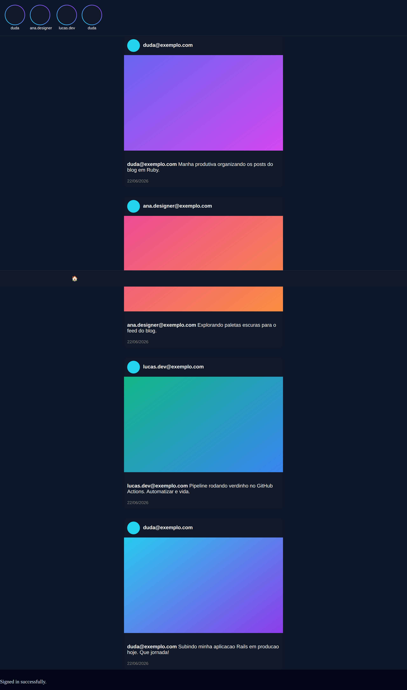
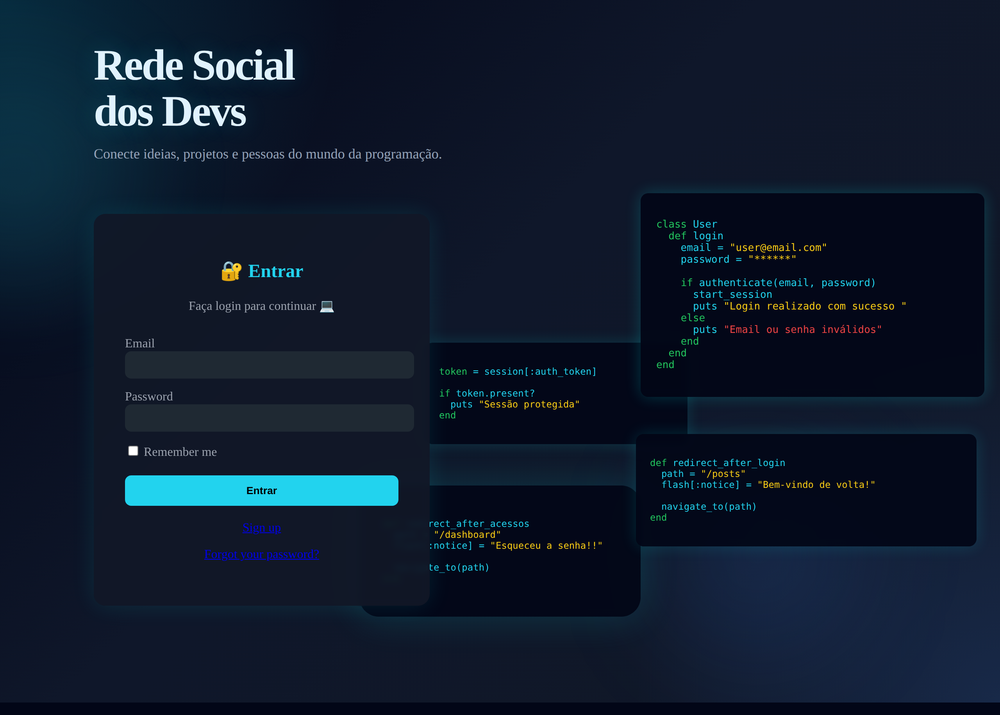
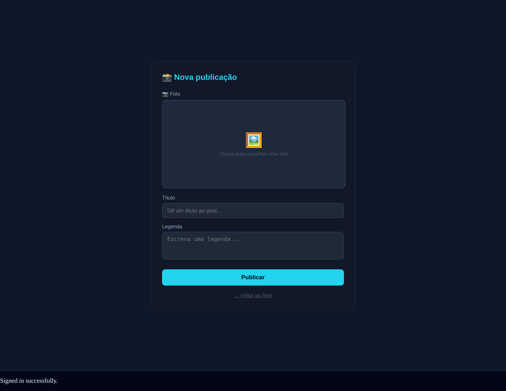

---

## Visão geral

Aplicação web onde usuários se cadastram, fazem login e publicam posts com imagem,
título e legenda. O feed exibe as publicações em ordem cronológica, em uma interface
escura inspirada em redes sociais modernas. As imagens são anexadas via Active Storage
e a autenticação é gerenciada pelo Devise.

<div align="center">
  
</div>

## Telas

<table>
  <tr>
    <td width="50%" valign="top" align="center">
      <strong>Login</strong><br/><br/>
      
    </td>
    <td width="50%" valign="top" align="center">
      <strong>Nova publicação</strong><br/><br/>
      
    </td>
  </tr>
</table>

## Funcionalidades

- Cadastro, login e logout de usuários com Devise
- Publicação de posts com imagem (upload via Active Storage), título e legenda
- Feed cronológico com as publicações de todos os usuários
- Página de perfil exibindo os posts do usuário logado
- Busca de posts por título
- Autenticação obrigatória nas páginas internas

## Stack

| Camada             | Tecnologia                            |
|--------------------|---------------------------------------|
| Linguagem          | Ruby 3.2                              |
| Framework          | Ruby on Rails 8.1                     |
| Autenticação       | Devise                                |
| Upload de arquivos | Active Storage + image_processing     |
| Front-end          | Hotwire (Turbo + Stimulus), Propshaft |
| Banco (dev)        | SQLite                                |
| Banco (produção)   | PostgreSQL                            |
| Deploy             | Render (Blueprint) / Docker + Kamal   |

## Modelo de dados

**User** (Devise) `has_many :posts`

**Post** `belongs_to :user`, `has_one_attached :image`

| Campo         | Tipo   | Observação            |
|---------------|--------|-----------------------|
| `title`       | string | Obrigatório           |
| `description` | text   | Obrigatório (legenda) |
| `image`       | anexo  | Active Storage        |
| `user_id`     | ref    | Autor da publicação   |

## Rotas principais

| Rota             | Descrição                |
|------------------|--------------------------|
| `/`              | Feed principal           |
| `/users/sign_in` | Login                    |
| `/users/sign_up` | Cadastro                 |
| `/posts`         | Listagem de posts        |
| `/posts/new`     | Nova publicação          |
| `/meu_perfil`    | Perfil do usuário logado |

## Como rodar localmente

Pré-requisitos: Ruby 3.2+ e Bundler.

```bash
# 1. Clone o repositório
git clone https://github.com/Dudainfinity/Meu-Blog-Ruby.git
cd Meu-Blog-Ruby

# 2. Instale as dependências
bundle install

# 3. Crie e migre o banco de dados
bin/rails db:prepare

# 4. Suba o servidor
bin/rails server
```

Acesse `http://localhost:3000`, crie sua conta e comece a publicar.

> O upload de imagens usa Active Storage. Para gerar variantes/redimensionamento em
> produção, é necessário ter o libvips ou o ImageMagick instalados no ambiente.

## Deploy no Render

O projeto já vem preparado para deploy no Render via Blueprint (`render.yaml`), com
PostgreSQL gerenciado em produção.

1. Conecte seu GitHub ao Render.
2. Escolha `New` e em seguida `Blueprint`.
3. Selecione o repositório `Meu-Blog-Ruby` (o Render lê o `render.yaml`).
4. Defina a variável `RAILS_MASTER_KEY` com o valor da sua chave local (`config/master.key`).
5. Confirme a criação do serviço web e do banco.

Variáveis relevantes: `RAILS_MASTER_KEY`, `SECRET_KEY_BASE` (gerada pelo blueprint) e
`DATABASE_URL` (vinculada automaticamente ao banco do Render).

Observação sobre imagens em produção: o Active Storage local não persiste uploads entre
deploys e reinícios. Para produção real, recomenda-se um armazenamento externo como
Amazon S3, Cloudinary ou Supabase Storage.

## Estrutura principal

```
app/
├── controllers/
│   ├── posts_controller.rb       # Feed, criação e busca de posts
│   ├── profiles_controller.rb    # Perfil do usuário logado
│   └── page_controller.rb        # Página inicial (feed)
├── models/
│   ├── post.rb                   # belongs_to :user, has_one_attached :image
│   └── user.rb                   # Devise + has_many :posts
└── views/
    ├── page/index.html.erb       # Feed principal
    ├── posts/                    # Listagem e nova publicação
    └── profiles/show.html.erb    # Perfil
```

---

Desenvolvido por [Dudainfinity](https://github.com/Dudainfinity).
